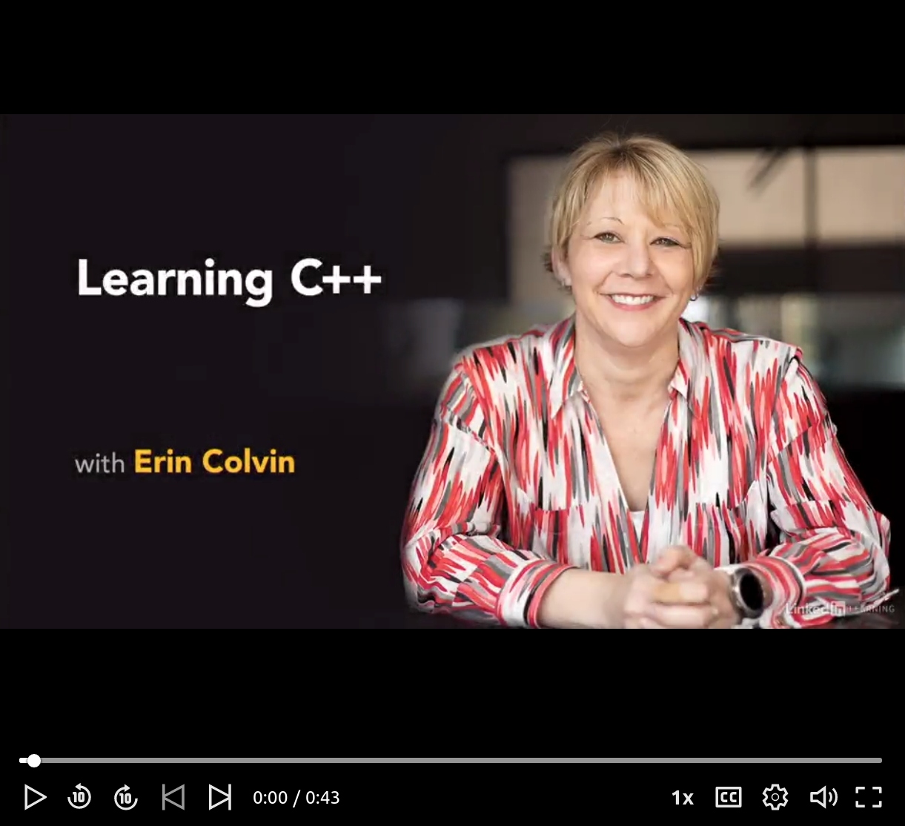
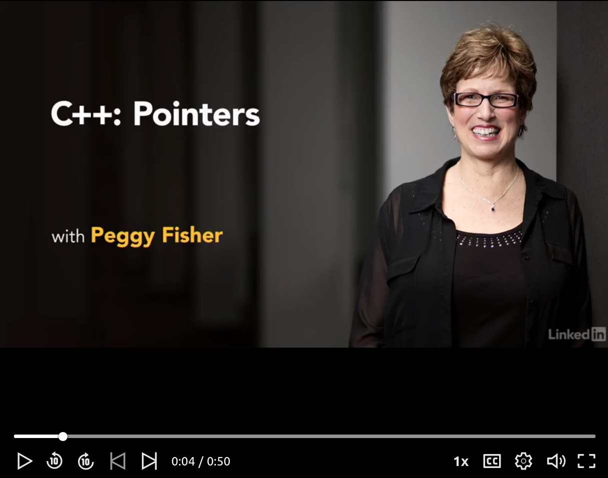

# Assignment - C++

> "It's time to learn a new language."

*It's time. You think to yourself. It's time to start looking for some work and begin your journey as a software engineer. There's no right path, and you'll take many twists and turns throughout your career, but you will find your path.*

*One thing that you can be assured of however, is that you can always be building your skillset. As you prepare yourself, you say to yourself, why not learn something new? Why not look at something that will challenge me, or perhaps just give me another tool I can leverage.*

*You type in 'C++' in your browsers search bar, and click 'go'*

# Resources to help

Provided below are a list of curated resources to help you complete the task(s) below. Consult them (read them, or do ctrl+f for keywords) if you get stuck.

1. https://www.linkedin.com/learning/learning-c-plus-plus-3/fun-with-c-plus-plus?u=74653650
	- Fun with C++, a 2 hour training
2. https://www.linkedin.com/learning/learning-c-plus-plus-pointers/welcome?u=74653650
	- Learning about Pointers in C++.

# Task 1

## The Task

Your task for this assignment is to spend time getting acquainted to the C++ language. You will complete the Lynda learning introduction to C++ with Erin Colvin: https://www.linkedin.com/learning/learning-c-plus-plus-3/fun-with-c-plus-plus?u=74653650. 

The rationale is that we want to use the right tool for teaching you the basic syntax of C++, and that happens to be this video tutorial series. As a Northeasern student, you have access to additional Lynda Learning (and other tutorials which may be helpful) through this link [linkedinlearning.northeastern.edu](linkedinlearning.northeastern.edu) or https://library.northeastern.edu/research/resources/items/linkedin-learning-formerly-lyndacom (Note, you may need to click this link first to authenticate before going to the lynda.com link).

Sometimes it is also nice to make sure you have time to sit down and learn a technology or langauge properly, and that is the goal of this first assignment. It's the first step we need to take to move onto more software engineering of projects!

**Note:** I encourage the use of VIM (Any platform), XCode (for mac users), CLion(Mac), Visual Studio (Windows), QTCreator(Any platform), or Codeblocks(Any platform) as IDE's for this course.

# Task 2

Now that you know the basics of C++, your next task is to become more familiar with memory management in C++. One of the main tools for accessing and modifying memory in C++ is the pointer.

You will next complete the course: Learning C++ Pointers https://www.linkedin.com/learning/learning-c-plus-plus-pointers/welcome?u=74653650 by Peggy Fisher.

I would also highly recommend you review my youtube version, at least the first 30 minutes or so to see what exactly a pointer is, and how to visualize it here: [Understand (almost) everything about the fundamentals of C++ pointers in 96 minutes
](https://youtu.be/2R5cjpi9Fzw) 

# Task 3

## Testing

In order for us as instructors to evaluate your learning on the C++ language, you will upload a screenshot showing you completed each of the C++ courses. 

We will download your repository and check for an image file named [./task1.jpg](./task1.jpg) and [./task2.jpg](./task2.jpg) in the Assignment1_cpp/part1 folder which shows the certificates verifying you completed the Lynda learning course.

# Submission/Deliverables

### Submission

- Commit all of your files to github, including any additional files you create.
- Do not commit any binary files unless told to do so.
- Do not commit any 'data' files generated when executing a binary.

### Deliverables

- Commit a screenshot in /Assignment1_cpp/part1 directory named [./task1.jpg](./task1.jpg) and [./task2.jpg](./task2.jpg) verifying completion of the C++ video tutorials on Lynda Learning. 
	- *You can click on each of the links above, and it should directly show your certificate*
	- *Please follow the specificiation and make this a .jpg image.* You can google how to take a screen shot (i.e. print screen) for your operating system, and then paste it into some image program to save as a .jpg (e.g. paint, pinta, Gimp, photoshop, etc.)

# Going Further

An optional task(if any) that will reinforce your learning throughout the semester--this is not graded.

1. Building a C++ String Library: https://www.lynda.com/C-tutorials/C-Building-String-Library/379656-2.html
	- A pragmatic project to exercise your C++ skills.
2. More C++: https://www.lynda.com/C-tutorials/C-Advanced-Programming-Topics/782128-2.html
	- Classes, and more.
3. https://www.lynda.com/C-tutorials/C-Essential-Training/772322-2.html
	- Useful introduction for C++ in about 5 hours of video.

# F.A.Q. (Instructor Anticipated Questions)

1. Q: Can I do some other video tutorial if I am an expert at C++?
	- A: Yes, but verify with your instructor first in a private piazza post.
2. Q: Which IDE should I be using in this class?
	- A: Use whatever IDE you want. At some point you will have to use tools on the command-line, but otherwise I do not care if you use VIM, Visual Studio, XCode, QT, etc. If you use a less popular tool, the course staff may have to take some additional time to learn (as well as your future team members!)
3. Q: Do I have to watch every single bit of the tutorial?
	- A: You can change the playback speed to be 2x for parts you may know well. Extra practice never hurts!
	- A: To be honest, now is not the time to skip tutorials to save time--learn the stuff now while things are slower in the semester (In this course and your other courses).
