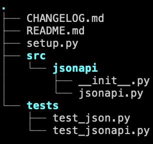

# Assignment 2

# Part 2 - Packaging the extended json library

In addition to extending the `json` standard library, you will create a basic python project and structure it in a 
logical manner that allows you to package and distribute your library to others

Alright-- let's add some structure to our project!

# Resources to help

Provided below are a list of curated resources to help you complete the task(s) below. Consult them (read them, or do ctrl+f for keywords) if you get stuck.

https://setuptools.pypa.io/en/latest/userguide/quickstart.html

https://setuptools.pypa.io/en/latest/references/keywords.html

https://mathspp.com/blog/how-to-create-a-python-package-in-2022

# Task 1 - Structure your project 

* Create a setup.py
* Create a README.md
  * Should describe the package, provide installation instructions and some code samples.
* Create a CHANGELOG.md
  * Should describe changes made. See this [link on various ways to create one](https://www.freecodecamp.org/news/a-beginners-guide-to-git-what-is-a-changelog-and-how-to-generate-it/_)
* Create a .gitignore file
  * Feel free to reuse the .gitignore file you created in Lab2 
* Put python packages in a `src` directory
* Put tests in a `test` directory

Ensure that you can create a source distribution and wheel from your project by running `python -m build`. You should see a 
`dist/` folder containing your tarfile and wheel.

# Task 2 - Create a repo on Github

On your personal Github account, create a new repo called `jsonapi`. Then push your local branch (should be named 'main') to your repo. 

# Task 3 - Create your first release

Before creating a release, you must create a tag from your main branch. Make sure that this tag is on your Github repo. 
On the Github UI, create your first release. See [this tutorial on Github](https://docs.github.com/en/repositories/releasing-projects-on-github/managing-releases-in-a-repository).

# Submission/Deliverables

- No files will be pushed to your monorepo
- Instead, your project files will be pushed to your new repo called 'jsonapi' on Github

### Submission

On Canvas, submit your URL to your `jsonapi` repo on Github.

- Commit all of your files to Github, including any additional files you create to your **jsonapi** repo on Github.
- Do not commit any binary files unless told to do so.
- Do not commit any 'data' files generated when executing a binary.

### Deliverables

- Task 1
	- Your Python project should be structured to support  

# Going Further

An optional task(if any) that will reinforce your learning throughout the semester--this is not graded.

1. See how [pyproject.toml](https://setuptools.pypa.io/en/latest/userguide/pyproject_config.html) is different (and better) than using setup.py. Also take a look at 'poetry' https://python-poetry.org/ as an alternative to `pip`. What are the benefits to using `poetry` over `pip`?

