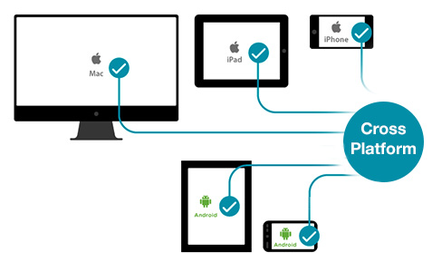
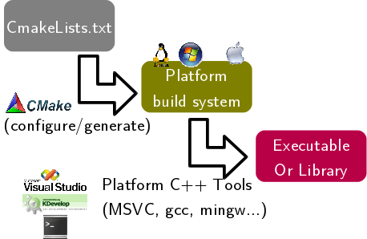

# Assignment 2

# Part 2 - Cmake (A meta build system)



**You will complete your [./src/part2/minipaint.cpp](./../part2/src/minipaint.cpp) in this directory.**

In addition to completing minipaint, you will also structure your project in a logical and physically sensable manner in this directory with a build system.

Alright-- let's add some structure to our project!

# Resources to help

Provided below are a list of curated resources to help you complete the task(s) below. Consult them (read them, or do ctrl+f for keywords) if you get stuck.

1. For Task 1 - Make and CMake
	- Make
		- A Simple Makefile tutorial
			- http://www.cs.colby.edu/maxwell/courses/tutorials/maketutor/
	- CMake
		- Main webpage for cmake with documentation
			- https://cmake.org/
		- A gentle introduction to Cmake
			- https://internalpointers.com/post/modern-cmake-beginner-introduction
		- A Complete Introduction to CMkae
			- https://www.youtube.com/watch?v=jt3meXdP-QI
		- CMake examples from company documentation
			- https://cmake.org/examples/
		- A Simple CMake tutorial
			- https://www.dealii.org/9.1.1/users/cmakelists.html
		- Another CMake example with Jason Turner (Video)
			- https://www.youtube.com/watch?v=HPMvU64RUTY	
		- How to CMake good (video series)
			- https://www.youtube.com/playlist?list=PLK6MXr8gasrGmIiSuVQXpfFuE1uPT615s
		- An Introduction to Modern CMake 
			- https://cliutils.gitlab.io/modern-cmake/

# What's changed since last time

To make our assignments a bit more organized cleaner, I have provided the following structure in this directory:

1. Source files (.cpp files) are moved into the [./src](./src) directory.
2. Header files(.hpp files) are moved into the  [./include/](./include) directory
3. Binaries(i.e. a.out for linux, .exe for windows, or .app for Mac) will be  created in the [./bin](./bin) directory. Remember though, you should not include binary files in your repository.

Note: While you may not use all of the directories for this assignment (i.e. it's possible you do not have any headers), you should setup your project to follow these conventions.

# Task 1 - CMake (Cross-platform make)


## Refresher

When we talk about 'building' software, that is the process of compiling, linking, and ultimately generating an executable that a user can run. This is a critical role to building software, and sometimes you will even see job postings for [build or release engineers](https://www.google.com/search?client=ubuntu&hs=cJ8&channel=fs&sxsrf=ACYBGNR0iLj1F1-QMYrWwnit5CCVbzZ_kw%3A1581722743195&ei=dyxHXsylC8Lr_QbC6aP4Bw&q=software+build+release+engineer+jobs&oq=software+build+release+engineer+jobs&gs_l=psy-ab.3...8631.12418..12567...0.3..0.123.1523.12j4....3..0....1..gws-wiz.......0i71j0i67j0j0i7i30j0i13j0i7i30i395j33i10i395.v7_UJK78uS8&ved=0ahUKEwiMvfaxmNLnAhXCdd8KHcL0CH8Q4dUDCAo&uact=5) as a full time role who have the responsibility of making sure when we hit 'compile' the software is built (Another example you might have seen are automated 'nightly builds' of software that is released in open source projects every day!).

### Build Systems

#### No build system

The most naive build system is to have no system at all! Follow along with the example below where every time we want to test changes to our program, we recompile the entire code base from scratch on the command line.

```
# (Run this within the part2 directory)
g++ -std=c++17 ./src/*.cpp -I./include/ -o App -lsfml-graphics -lsfml-window -lsfml-system
```

Now what happens if we forget the exact series of commands we typed on the terminal to compile our application? Or what if we want to change arguments sent to our compiler to control how we build the software? And what happens if multiple engineers build the same piece of software, but with different arguments sent to the compiler? 

Thus, typing out the above line on the command line is not very robust (i.e. it is prone to error and lacks consistency). So instead of remembering the exact command-line, we may write a shell(.sh) or python3(.py) script so we do not have to remember the exact command line to type in. See the following example below:

```python
# Python shell example (compileAndBuild.py)

# Create a file called compileAndBuild.py
# Run with: python3 compileAndBuild.py
import os

os.system("g++ -std=c++17 ./src/*.cpp -I./include/ -o App -lsfml-graphics -lsfml-window -lsfml-system")
```

By utilizing a programming language(such as python3 or bash as two examples) we can program how we compile our software in a more consistent way. A script file additionally allows us to control how we build our software such that we can even add logic (i.e. conditional statements) in our code about how to compile our software under certain conditions. Below is another example script showing how to compile the same application, but in two different configurations: one version is a debugged version of the software, and the other is a release version of the software.

```python
# Python shell example (compileAndBuild.py)
# Run with: python3 compileAndBuild.py
import os

def compile():
    DEBUG = input("How would you like to build your software? (debug or release)")

    if DEBUG=="debug":
        print("Starting Debug Build")
        # We have added the '-Wall' to report warnings for our C++ compiler
        # We have added the '-Werror' option to treat warnings as errors.
        # We have added the '-g' flag to generate debugging symbols
        # We have added the '-D DEBUG' to define a symbol for our preprocessor to execute certain blocks of code related to debugging.
        os.system("g++ -Wall -Werror -g -std=c++17 ./src/*.cpp -I./include/ -o App -lsfml-graphics -lsfml-window -lsfml-system")
    else:
        print("Starting (Optimized) Release Build")
        # Release version of our software
        # We have added the '-O2' option to compile an optimized version of our code
        os.system("g++ -O2 ./src/*.cpp -I./include/ -o App -lsfml-graphics -lsfml-window -lsfml-system")

if __name__ == "__main__":
    compile()
```

With this approach of scripting, you could use variables to store configuration options such as which compiler to use and which arguments to send into our compiler. We could even change these options based on which platform (i.e. operating system) we are compiling our code on. The example below adds a little more logic to our build scripts to change control flow based on the desired platform (our manager is starting to get happy with this solution!)

```python
# Python shell example (compileAndBuild.py)
# Tested on Ubuntu 18.04
#
# Run with: python3 compileAndBuild.py
import os
import platform

# (1)==================== COMMON CONFIGURATION OPTIONS ======================= #
COMPILER="clang++ -std=c++17"   # The compiler we want to use 
                                # Let's try clang++ this time isntead
SOURCE="./src/*.cpp"    # Where the source code lives
EXECUTABLE="App"        # Name of the final executable
# ======================= COMMON CONFIGURATION OPTIONS ======================= #

# (2)=================== Platform specific configuration ===================== #
# For each platform we need to set the following items
ARGUMENTS=""            # Arguments needed for our program (Add others as you see fit)
INCLUDE_DIR=""          # Which directories do we want to include.
LIBRARIES=""            # What libraries do we want to include

if platform.system()=="Linux":
    ARGUMENTS="-D LINUX" # -D is a #define sent to preprocessor
    INCLUDE_DIR="-I ./include/"
    LIBRARIES="-lsfml-graphics -lsfml-window -lsfml-system"
elif platform.system()=="Windows":
    COMPILER="g++ -std=c++17" # Note we use g++ here as it is more likely what you have on Windows
    ARGUMENTS="-D MINGW -static-libgcc -static-libstdc++" 
    INCLUDE_DIR="-I ./include/"
    EXECUTABLE="App.exe"
    LIBRARIES="-lsfml-graphics -lsfml-window -lsfml-system"

# (3)====================== Building the Executable ========================== #
# Build a string of our compile commands that we run in the terminal
compileString=COMPILER+" "+ARGUMENTS+" -o "+EXECUTABLE+" "+" "+INCLUDE_DIR+" "+SOURCE+" "+LIBRARIES
# Print out the compile string
# This is the command you can type
print("============v (Command running on terminal) v===========================")
print("Compilng on: "+platform.system())
print(compileString)
print("========================================================================")
# Run our command
os.system(compileString)
```

Now you can imagine though, writing a piece of software (i.e. our python script which is quickly growing in size) to build a project (in fact, any unique project that you create) does not scale very well. Small script files like those previously demonstrated are likely helpful for small to medium sized projects, but for large projects with many team members it is unlikely to scale well. We are also prone to mistakes and bugs in our script files as well! So a long time ago instead of writing a custom script for compiling our project in different ways, folks created a language and a build system specifically for compiling, linking, and generating executables. This system is called [Make](https://www.gnu.org/software/make/). (Read below)

**Before proceeeding** Delete the 'App' or 'App.exe' binary if you have previously created one.

#### Make

Make is a system that takes in a special script file (called a 'makefile' or 'Makefile') which contains different rules for compiling, linking, and generating software. Below is an example 'Makefile' which we can use to compile our project and the corresponding output of using the makefile. You'll notice we have variables that can store things like the compiler we are using, the libraries, and so on. 

**For the next example** practice typing it in as opposed to copying in pasting. Note, that the 'Make' build system also has a special syntax where tabs matter!

```bash
########################################################################################
# A sample makefile                                                                    #
# Type: 'make makefile' to run                                                         #
#       (Or you can simply type 'make' and if a file called 'makefile' is found in the #
#        current directory it will be executed with the first build rule.)             # 
########################################################################################
CC=g++                  # The compiler that we will use
CFLAGS=-std=c++17       # Any flags to the compiler
LIBS=-lsfml-graphics -lsfml-window -lsfml-system # Libraries we want to link in
                                                 # We may want to distinguish between
                                                 # 'static' and 'dynamic' libraries
INCLUDE=-I./include/                             # Include directory where header files
                                                 # are located. For now, we will look
                                                 # inside the current directory only.
BINARY=./bin/App 		# Output directory where our binary will be placed


# Our first 'build rule'. We can have as many as we like.
App: 
	$(CC) $(CFLAGS) ./src/*.cpp $(INCLUDE) -o $(BINARY) $(LIBS)
```

**Sample output**

```bash
mike@mike-MS-7B17:$ make
g++ -std=c++17 ./src/*.cpp -I./include/ -o App -lsfml-graphics -lsfml-window -lsfml-system
mike@mike-MS-7B17:$ make
make: 'App' is up to date.
```

To use our Makefile we can simply type 'make' and it will execute the first build rule ('App') by default within a file named 'Makefile' or 'makefile' in our current directory. Observe from the output, that if we try to build the software immediately after we have built it, the make build system is smart enough to know that since there had been no source code changes made, there is no need to recompile. This is a great time saver, especially as our software project scales! The make system has the ability to do this on a source code file basis, so the above example is a very simple demonstration.

##### Make Clean

On occassion, it is helpful to make sure you have a complete 'refresh' of the software you are building. We call this the 'clean' rule, where we can clean up any binary or temporary files that have been generated. Let's add this to our current makefile(See the rule named `clean:` below) and see how this is used.


A new Makefile with the clean rule has been added below. Now you can specify on the command line the exact 'build' command you want to do (i.e. `make App` or `make clean`)

```bash
########################################################################################
# A sample makefile                                                                    #
# Type: 'make makefile' to run                                                         #
#       (Or you can simply type 'make' and if a file called 'makefile' is found in the #
#        current directory it will be executed with the first build rule.)             # 
########################################################################################
CC=g++                  # The compiler that we will use
CFLAGS=-std=c++17       # Any flags to the compiler
LIBS=-lsfml-graphics -lsfml-window -lsfml-system # Libraries we want to link in
                                                 # We may want to distinguish between
                                                 # 'static' and 'dynamic' libraries
INCLUDE=-I./include/                             # Include directory where header files
                                                 # are located. For now, we will look
                                                 # inside the current directory only.
BINARY=./bin/App 		# Output directory where our binary will be placed


# Our first 'build rule'. We can have as many as we like.
App: 
	$(CC) $(CFLAGS) ./src/*.cpp $(INCLUDE) -o $(BINARY) $(LIBS)

# For now a very simple 'clean' rule that will remove the 'App' that
# we have created. In practice, we can remove any other automatically
# generated files, such as ".o" files.
clean:
	rm $(BINARY)
```

**Sample Output** (This time showing that the clean command removes any files generated from our source code, so we can rebuild our application from scratch (Some IDE's do this behind the scenes when you press 'clean solution' or 'rebuild all').

```bash
mike@mike-MS-7B17:$ make
g++ -std=c++17 ./src/*.cpp -I./include/ -o App -lsfml-graphics -lsfml-window -lsfml-system 
mike@mike-MS-7B17:$ make
make: 'App' is up to date.
mike@mike-MS-7B17:$ make clean
rm App
mike@mike-MS-7B17:$ make
g++ -std=c++17 ./src/*.cpp -I./include/  -o App -lsfml-graphics -lsfml-window -lsfml-system 
```

#### CMake

Great, so let's have our whole team use make! Not so fast--what if we want to use other tools like Visual Studio, XCode, IntelliJ, Eclipse, Codeblocks, etc? While these IDE's can be configured to run makefiles, we can utilize yet another tool to help us generate makefiles regardless of the platform--this tool is called CMake. CMake is a 'meta-build' system.



The idea with the CMake tool (which stands for cross-platform make) is that a scripting language can be used to generate the correct project files to compile your software. That is, CMake locates a collection of source code files, and then will generate either a 'makefile', XCodeProject, Visual Studio Project, etc. for you. So regardless of what type of IDE you want to use, you have a consistent way to build your software.

The following is a snippet that you can create in the root directory a [CMakeLists.txt](./CMakeLists.txt). The [CMakeLists.txt](./CMakeLists.txt) file is a specifically named file (just like the 'makefile') which 'cmake' tool reads in and then will generate an associated build file--whether it be a 'makefile', XCodeProject, Visual Studio Project, etc.

Your next action items:

- [x] [Download CMake](https://cmake.org/download/) (The GUI or command-line version is fine)
- [x] Modify [CMakeLists.txt](./CMakeLists.txt) below. 
	- **Do not** just copy and paste the text. Type it in, make mistakes, fix the errors, and then run the file, that is how you will learn!
- [x] Navigate to the 'bin' directory and run CMake from within this directory following the instructions in the script file below.

```
####################################################
# CMake is a build file generator.
# It does not compile your software, but
# rather uses the CMake Language to 
# figure out how to generate another file
# for which you can then use to build projects.
# CMake is a specification language for build tools.
####################################################

############### INSTALLATION #######################
# Installation on Linux
# 'sudo apt-get install cmake'
#
# Installation on Mac (But prefer Linux)
# 'brew install cmake'
#
# Installation on Windows (But prefer Linux)
# See download page and download
####################################################

############## How to use CMake ####################
# I recommend you create a separate directory for
# your CMake generated files. This is a clean way
# to separate out all of your binary files generated
# from the source code. An example on Linux is
# the following:
#
# mkdir bin	# Make a directory
# cd bin	# navigate to that directory
# cmake .. 	# Then execute the CMakeLists.txt
#		# file found one directory up.
####################################################

####################################################
# Writing a CMake file involves writing one 
# cmake command per line.

# The minimum required version of CMake to use
cmake_minimum_required(VERSION 3.10)

# Set the project name to your project name
# Additionally, we specify the languages we need
# to use with our project 'App' which happen
# to be 'C++' (CXX), and 'C' is also included
# just in case we mix C in our C++ code
project(
    App             # Name of our application
    VERSION 1.0     # Version of our software
    LANGUAGES CXX)  # Language that we are using

# We can additionally set the langauge standard for
# C++
set(CMAKE_CXX_STANDARD 17)

# Where are the include directories
include_directories("/usr/include/")
include_directories("./include/")

# Where are the libraries
# Hint: On linux you can grep for them: ldconfig -p | grep sfml
link_directories("/usr/lib/x86_64-linux-gnu/")

# Add the source code files to a specific project
# We can indeed have multiple executables generated from
# one CMakeLists.txt file.
# For example, we might have test files that we want
# to generate.
#
# Here is an example below adding multiple .cpp files
add_executable(App ./src/App.cpp ./src/Draw.cpp ./src/Command.cpp ./src/main.cpp) # example with more files


# Add any libraries
# On linux, you can use the handy 'apt-file' tool to find
# where exactly header files exist. See example below:
# 	sudo apt install apt-file
#   	sudo apt-file update
# 	apt-file find Texture.hpp
target_link_libraries(App sfml-graphics sfml-window sfml-system)
```

**Sample Output**

```
mike@mike-MS-7B17:~/monorepo-template/Assignment2_SFML_and_cmake/part2/bin$ cmake ..

mike@mike-MS-7B17:~/monorepo-template/Assignment2_SFML_and_cmake/part2/bin$ ls
CMakeCache.txt  CMakeFiles  cmake_install.cmake  Makefile  Readme.md

mike@mike-MS-7B17:~/monorepo-template/Assignment2_SFML_and_cmake/part2/bin$ make
Scanning dependencies of target App
[ 50%] Building CXX object CMakeFiles/App.dir/src/minipaint.cpp.o
[100%] Linking CXX executable App
[100%] Built target App
mike@mike-MS-7B17:~/monorepo-template/Assignment2_SFML_and_cmake/part2/bin$ ./App 

```

Note: You should not modify the makefile. From now on, when you want to make changes to how you compile your program (e.g. you add a new source code file), you will re-run cmake to generate a new makefile for you automatically. Then after you regenerate your makefile, you can rebuild your application.

#### CMake Generators

Okay, so far you have a [CMakeLists.txt](./CMakeLists.txt) file from the previous section. Now what if you want to generate a project file for the CodeBlocks IDE instead of the default 'makefile'. You need to instruct CMake what type of file to generate--thus, you would run the following: 

`cmake .. -G"CodeBlocks - Unix Makefiles"`

How did I figure this command out? The 'G' stands for generator, and it will generate a CodeBlocks project file (App.cbp in this case within your bin directory, which you will then rebuild your solution, and then run your program from there). To find out what projects can be generatored, try running:

`cmake --help`

Again the power of CMake is the ability to generate a project for a particular IDE or tool. Now within your team, need only manage a series of CMakeLists.txt files, and then you can build your software consistently regardless of platform!

## Your Task

1. Download and install CMake for your respective operating system. You may use the command-line or GUI tools.
2. Write a [CMakeLists.txt](./CMakeLists.txt) file and generate a project file(i.e. Visual Studio Solution, makefile, xcodeproject,etc.) of your choosing.

### Advice

Just like with programming, CMake is a simple language. I recommend slowly building up your [CMakeLists.txt](./CMakeLists.txt) file, or experimenting on a simple 'hello world' project to get something working first. Make one small change, then try to run cmake, and then continue to iterate.

CMake may also 'cache' your configuration options the first time you generate a project. When you see new files have been created, but perhaps not the correct ones you would like, simply remove any generated files from CMake in the bin directory.

## Testing

- Task 1
	- You should be able to use your [CMakeLists.txt](./CMakeLists.txt) file to generate a build file that can compile the code provided in the source directory.
	- When we grade, we are going to use your [CMakeLists.txt](./CMakeLists.txt) to generate a makefile to build your minipaint program.

# Submission/Deliverables

- Git add/commit/push your [CMakeLists.txt](./CMakeLists.txt) file.

### Submission

- Commit all of your files to github, including any additional files you create.
- Do not commit any binary files unless told to do so.
- Do not commit any 'data' files generated when executing a binary.

### Deliverables

- Task 1
	- A [CMakeLists.txt](./CMakeLists.txt) file should be pushed to your directory.

# Going Further

An optional task(if any) that will reinforce your learning throughout the semester--this is not graded.

1. Take a look at 'ninja' https://ninja-build.org/ another top build system that some claim is faster than GNU Make or other build systems.

# F.A.Q. (Instructor Anticipated Questions)

1. Q: I don't know CMake
	- A: See the resources provided.
2. Q: I don't see my generator for CMake for Visual Studio
	- A: Try downloading a newer version of CMake.
3. Q: Do I need to run the doxygen for this assignment?
	- A: No
4. Q: CMake is not running my new project.
	- A: Try deleting the files generated (CMakeCache.txt and any other files or directories). CMake attempts to be efficient and not regenerate all of the files when rebuilding your generated build project, and on occassion this causes problems if you have made changes to the CMakeList.txt file.
