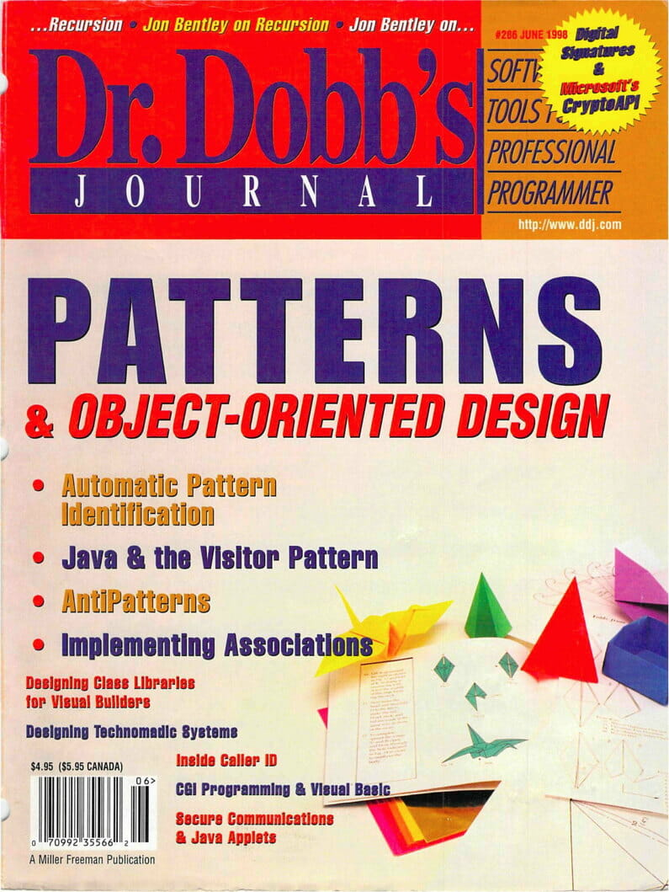
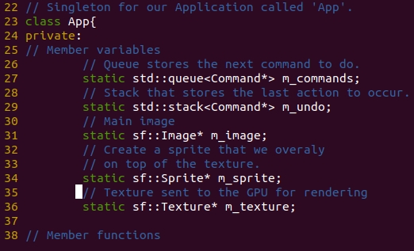
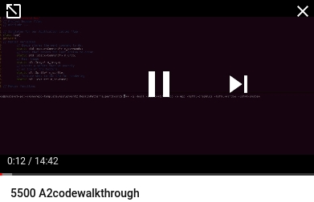
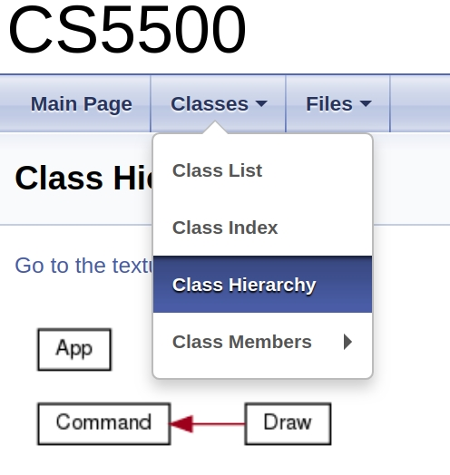
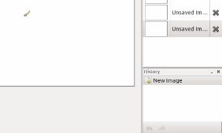

# Assignment - Design Patterns

> "Learning from the Pros"

# Resources to help

Provided below are a list of curated resources to help you complete the task(s) below. Consult them (read them, or do ctrl+f for keywords) if you get stuck.

1. For Task 1 - C++ Code Review
	- Singleton Pattern
		- https://gameprogrammingpatterns.com/singleton.html
	- Static Member Initialization
		- https://isocpp.org/wiki/faq/ctors#link-errs-static-data-mems
		- The heavy usage of static
	- SFML
		- The learn page
			- https://www.sfml-dev.org/learn.php
	- Function pointers
		- https://www.learncpp.com/cpp-tutorial/78-function-pointers/
			- Just like we can have pointers to any data type, we can have a pointer to a function. Think of it this way, the start of a function must be stored somewhere (i.e. an address), so we can point to that address. Read the tutorial and seek out others to get the syntax right.
	- Call back functions
		- https://thispointer.com/designing-callbacks-in-c-part-1-function-pointers/
			- Call back functions are functions that we pass into an API, and then they are called automatically from some API for us at a later time.
1. For Task 2 - Supercharging software development
	- doxygen
		- http://www.doxygen.nl/
			- The doxygen homepage
		- https://caiorss.github.io/C-Cpp-Notes/Doxygen-documentation.html#org0a1573c
			- Notes on doxygen
	- graphviz
		- https://www.graphviz.org/
			- Note you may need to install this as a dependency of doxygen so you can view inheritance diagrams in your doxygen. `apt install graphviz`
3. For Task 3 - Behavior Pattern
	- My video on an implementation of the pattern: https://www.youtube.com/watch?v=ILgiCy6IXLw
	- Command Pattern
		- https://gameprogrammingpatterns.com/command.html
			- This resource shows an example of the command pattern in C++ for an undo/redo system.
			- This pattern is also particularly useful for logging or tracking events.
	- Undo/Redo writeup
		- Nice writeup here in plain English: https://gist.github.com/mlynch/ab554d84dc3b7b8be3d6 	

# Task 1 - C++ Code Review

## Refresher

The singleton pattern is a way to structure your code such that you only have one instance. Provided in this assignments starter code is a singleton called __App__. We'll think about later on in the project if a refactoring is needed, but for now it serves as a good central place to store our canvas.

## Your Task

Watch the following video discussing the design of your starter code. Understand that you are allowed to refactor the code in any way you like in order to meet the goals of Task 3. There is enough *new* C++ things however, that you should watch the video at least once to get a high level overview of the system.

**Your next task** is to look through the example(s) in the [tutorial](./tutorial) folder. There is a writeup of how function pointers work (which are used in this sample code). Read through it, and play with the example until you understand.

### Advice

My other advice is to first make a plan before making any code changes. Then make very small changes (i.e. exactly 1 in most cases), recompile, and then fix any bugs. Making lots of changes or refactoring the code and then testing simply does not often work well even for experienced programmers!

**Click and watch** https://www.youtube.com/watch?v=cfwXpnFzju4&feature=youtu.be (15 minutes)

# Task 2

## Documentation Generator

Providing documentation for software is important. From the first task you have been provided a high level overview of the code in a video format. However, most software projects you work on are unlikely to provide a high level overview. That is why documenting your source code, and keeping your comments up to date with what the code is doing is so important. Writing good comments in your source code means documenting the **why something was done** in software, and is just as important as the **how** (i.e. the algorithm) something is implemented. And while navigating directly into the source code to view comments is an effective skill, it can also be useful to use tools to generate webpages that allow us to navigate source code and also receive a visual layout of our code structure. Seeing a UML diagram for instance of the layout of a class, or the inheritance hiearchy of a class can be very useful!

[Doxygen](https://www.doxygen.nl/index.html) is a too that generates documentation from source code. This tool allows us to view source code, comments, and even graphical representations of our software architecture (i.e. UML diagrams) very quickly.

### Doxygen

From the command line generate the doxygen documentation using the following: `doxygen doxygen.txt`

- The [doxygen.txt](./doxygen.txt) is a configuration file providing instructions about which folders to find source code.

**Note**: You may need to install other dependencies such as graphviz to generate class diagrams in your documentation.

### Resources

There also exists a tool called doxywizard which may be helpful if you struggle getting the command line to work: 

- http://www.doxygen.nl/manual/doxywizard_usage.html

## Your Task

# Task 3 - Structural Command Pattern (Command Pattern)

We have learned about various creational, behavioral, and structural command patterns. For this assignment, you are going to implement a structural pattern known as the 'command' pattern. This pattern in a nutshell states:

> Encapsulate a request as an object, thereby letting users parameterize clients with different requests, queue or log requests, and support undoable operations.

Source: [https://gameprogrammingpatterns.com/command.html](https://gameprogrammingpatterns.com/command.html)

Take a moment to read the above chapter (I think you're going to have a lot of questions if you don't read it--seriously it's a fun read and quite insightful!). The key feature again of the command pattern, is that we can log actions that occur in our program. So an event like modifying a pixel for example will be modeled as an individual command.

In an application like a paint program, it is important to be able to think in commands as we modify our canvas. A key motivation of this, is we're able to avoid using 'setPixel' and exposing parts of our API directly in the main.cpp.

Now, before you implement the pattern, **goto the design.md** [design.md](design.md) **graded** to sketch out how you are going to implement the command pattern.

## Requirements

We are going to implement the command pattern with the following requirements:

- [ ] Any time a pixel is modified, it must be as a command.
- [ ] Each command must be processed through some intermediate data structure (e.g. a queue, stack, list, vector, tree, or whatever makes sense--you need to decide).
- [ ] A history of the commands executed should be kept for at least the last or previous 10 commands (though there need not be a limit, 10 is an arbitrary number, but ideally you can handle 1000s), such that a user can 'undo' (at least 10 times) with by pressing the 'z' key and redo by pressing the 'y' key (at least 10 times).
	- Note undo/redo function should emulate a painting program.
	- i.e. I can only do a 'redo' after doing an 'undo'. If I do a new command, I can no longer redo.
	- 
- [ ] Executing the same command twice in a row should not be recorded. Think of this as a performance optimization where you are not changing the same pixel to the same color twice in a row.
    - Consider implementing `operator==` so you can determine if two commands were the same.
- [ ] Modifying a pixel should only be done when pressing the 'left mouse key'

## Design Decisions

First, determine what sort of data structure you need. You may further need to modify the provided starter code.

## Testing

- Task 1
	- N/A
- Task 2
	- Ensure that you have a docs/ folder committed to your repository
		- You **should** commit your doxygen documentation (i.e. the docs/ folder) to the repository
- Task 3
	- Implement the command pattern, and make sure the undo/redo history can go backwards or forwards at least 10 times when pressing 'z' or 'y'.

# Submission/Deliverables

### Submission

- Commit all of your files to github, including any additional files you create.
- Do not commit any binary files unless told to do so.
- Do not commit any 'data' files generated when executing a binary.

### Deliverables

- Task 1
	- N/A
- Task 2
	- docs/
- Task 3
	- A working implementation of App with and undo/redo system.

# Going Further

An optional task(if any) that will reinforce your learning throughout the semester--this is not graded.

1. Implement a 'line' function instead of just drawing dots to get a continuous drawing function.
2. Set the 'refreshRate' to be once every 60 frames.

# F.A.Q. (Instructor Anticipated Questions)

1. Q: Can I change the code or add new classes, or remove files?
	- A: Yes.
2. Q: Can I remove the 'MouseMoved' event.
	- A: Yes you should as given in the requirements, only left mouse clicks should modify pixels. You may also refactor your update function to use either the 'pollEvent(event)' or otherwise to use 'isButtonPressed' to detect events if you like.
3. Q: Do I have to document any new functions or files I create in the doxygen style?
	- A: Yes.
4. Q: Should I support features from the previous assignment?
	- A: For this assignment you need to support what is provided in this write up. So you do not need to support having multiple colors for example from the previous assignment. However, you may support additional features, and it is okay to build or reuse some of the code you have written from the previous assignment--but they must all work.
5. Q: Doxygen is not producing .dot graphs of the class diagrams
	- A: You can try adding: `HAVE_DOT = YES` to the doxygen.txt
6. Q: If I try to 'redo' and there are no actions to redo, what happens?
	- A: Nothing. Make sure your program does not segfault.
