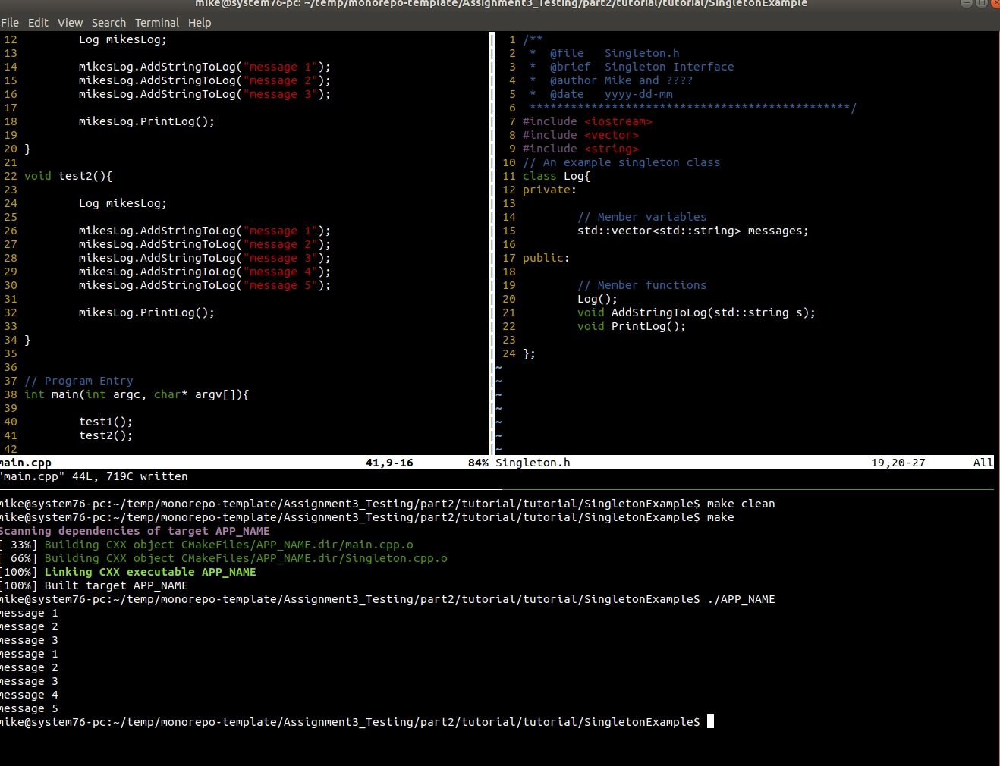

# Tutorial

Folks have questioned the Singleton Pattern. And by now you should have an idea of some of the pros and cons. Sometimes we just need to have global state stored somewhere. However, one of the cons of the Singleton pattern is that it can make testing more difficult. In this first part, you are going to watch a video and refactor out the Singleton from the provided code example.

See tutorial video for refactoring: https://www.youtube.com/watch?v=tHAiDNcqnAQ&feature=youtu.be

