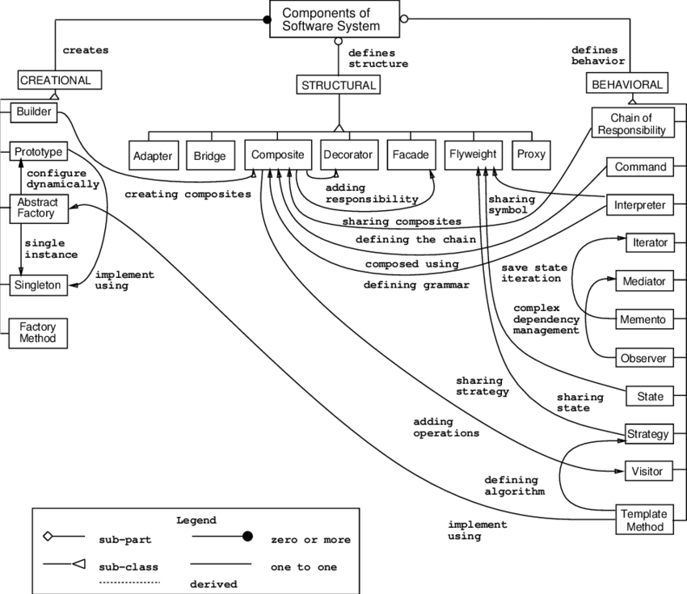
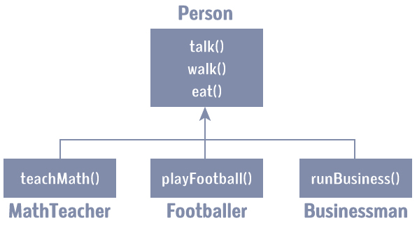

# Lab 3




> "Design Patterns"

Whether you start working in industry, your own startup, or as a researcher, there is a strong likelihood that the projects you are going to develop or work on are going to grow in size. It's not uncommon to be working on codebases of millions of lines each release of the project. Because our brains can only hold so much information, we often need to rely on useful abstractions to help us organize and maintain all of the information. Today we are going to practice refactoring our code, and then implementing a design pattern.

For your lab today, you will be working with C++ you will be practicing object-oriented programming and a design pattern.

# Implementation Logistics

- You may use whatever operating system, IDE, or tools for completing this assignment.
	- However, my instructions will usually be using the command-line, and that is what I will most easily be able to assist you with.
- In the future there may be restrictions, so please review the logistics each time.

# Resources to help

Provided below are a list of curated resources to help you complete the tasks below. Consult them (read them, or do Ctrl+f for keywords) if you get stuck.

- Task 1
	1. http://www.cs.ust.hk/~dekai/library/ECKEL_Bruce/TICPP-2nd-ed-Vol-one/TICPP-2nd-ed-Vol-one-html/Chapter14.html
		- Thinking in C++ free book chapter discussing composition vs inheritance.
- Task 2
	1. My Video on the Singleton Pattern
		- [Design Patterns - Singleton Pattern | Explanation and Implementation in C++](https://youtu.be/eLAvry56vLU)
	2. https://gameprogrammingpatterns.com/singleton.html
		- Nice walkthrough on the Singleton pattern, as well as others (in a gaming context)

# Task 1 - Inhertiance vs Composition

## Object-Oriented Programming



We want to get in the habit of writing code that is modular and maintainable. Often that means reducing [coupling](https://en.wikipedia.org/wiki/Coupling_(computer_programming)) in our code such that our codebase can be changed without efforts to rearchitect the entire product. One common way developers create new types however, is by the use of inheritance. A reminder that inheritance is the ability to create a new sub-class (the new thing we are creating) by deriving from a pre-existing base class. One problem with this however, is that sometimes the inheritance hierarchy can quickly grow out of control, and our code becomes very 'coupled' together.

### Your task

Take a moment to look at the code labeled [./src/oop.cpp](./src/oop.cpp). You may compile the code if you like (see comments in code for compilation instructions). Overall the *oop* source is not many lines of code, but there are many decision decisions as well as some new concepts I want you to explore in C++ even within a single file.

**You task** Review [./src/oop.cpp](./src/oop.cpp) and document your changes that you make in the code as guided by [exercises.md](./exercises.md).

# Task 2 - Design Pattern

## Singleton

The Singleton pattern is a design pattern that we have previously learned about. Some say having one object that is globally scoped is never worth having and take a strong stance towards never having global objects (i.e. The singleton pattern is an anti-pattern). However, sometimes the singleton can be useful if we need a single place to log information (Note: With threads we may need to think more about our design and have locks for instance). The following below is a partial implementation of a Singleton.


```cpp
class MySingleton{
  private:
    MySingleton();  // Private Singleton
    MySingleton(MySingleton const&); // Avoid copy constructor
    void operator=(MySingleton const&); // Don't allow assignment.
    // ... // perhaps other private members
    
  public:
  
  static MySingleton &getInstance();
    
  // ... Here is where you would add other public functions
  // ...
  
  // *Hint you may need at least one member variable for the datatype you are supporting*
  // static ...
}:
```

Refactor the logger provided in [./src/singleton.cpp](./src/singleton.cpp) with the following changes requested in [exercises.md](./exercises.md).

## Testing

- Make sure your code for Task 1 and Task 2 compiles.

# Submission/Deliverables

- Task 1
	- We are going to review your refactored [./src/oop.cpp](./src/oop.cpp)
	- Then look to make sure you answered your questions in [exercises.md](./exercises.md).
- Task 2
	- We are going to review your refactored [./src/singleton.cpp](./src/singleton.cpp) to see an implementation of a logger.
	- Then look to make sure you answered your questions in [exercises.md](./exercises.md).

### Submission

- Commit all of your files to github, including any additional files you create.
- Do not commit any binary files unless told to do so.
- Do not commit any 'data' files generated when executing a binary.

# Rubric

You (and any partner(s)) will receive the same grade from a scale of 0-2. Both partners should commit the same code.

- 0 for no work completed by the deadline
- 1 for some work completed, but something is not working properly
- 2 for a completed lab (with possible 'going further' options completed)

# Going Further

An optional task(if any) that will reinforce your learning throughout the semester--this is not graded.

1. Try implementing more design patterns that you have learned today!

# F.A.Q. (Instructor Anticipated Questions)

1. Q: The [static](https://en.cppreference.com/w/cpp/keyword/static) keyword is confusing, and I do not understand how to use it to implement a Singleton.
	- A: See Below 
	
The main idea with the singleton is that you can take advantage of 'static' functions. member functions with the 'static' qualifier in C++ are shared among all instances of a class (An instance of a class, is the object when you create a new variable). We want to make sure we have a way to guarantee that through this 'instance' function we are always utilizing the same object, and one way to do that is to return memory to a 'static' variable..

Let's pick an example:

Say we are going to create '5' instances of a class called Student

```cpp
class Student{
public:
// Member functions
	static Student& instance(){// ...}
	void StudentName(std::string name) { // ..}
// Member variables
	static int studentCount;
};
```

Each of the 5 students may have an individual name set by the 'StudentName' function. However, if we use the 'static' member function 'instance' then that can potentially effect all of the data shared among all instances of objects with type 'Student'

Similarly, member variables can be static, and are also shared. Perhaps for example, every time we create a new 'Student' we increment studentCount, such that we can keep track of how many of these objects of this specific Data type exist.
 
Finally, a third way to use 'static' is within a member function.

```cpp
static Student& instance(){
	static Student whoever = new Student; // 'whoever' is gaureenteed only to be 
					      // invoked once, and whatever its value is
                                              // is shared in all 'Students' when they call
				              // the 'instance' member function.
	return *whoever;
}
```
