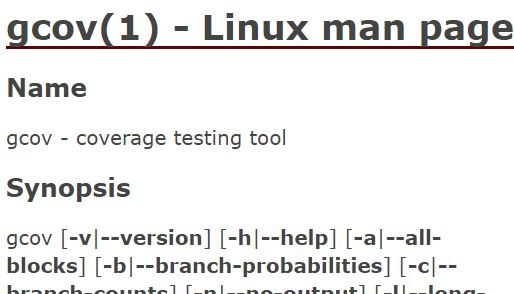
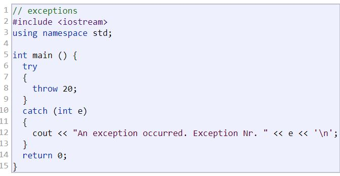
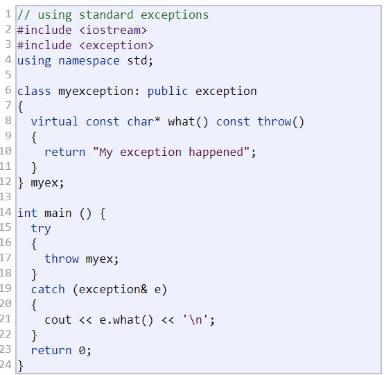

# Lab 6

> "C++ Testing"



For your lab today, you will be practicing writing tests

# Implementation Logistics

- You may use whatever operating system, IDE, or tools for completing this assignment.
	- However, my instructions will usually be using the command-line, and that is what I will most easily be able to assist you with.
- In the future there may be restrictions, so please review the logistics each time.

# Resources to help

Provided below are a list of curated resources to help you complete the tasks below. Consult them (read them, or do Ctrl+f for keywords) if you get stuck.

- Task 1
	1. gcov
		- https://www.tutorialspoint.com/unix_commands/gcov.htm
			- Useful tutorial on understanding code coverage
		- https://gcc.gnu.org/onlinedocs/gcc/Gcov.html
			- Official GNU documentation 
- Task 2
	1. Exceptions
		- http://www.cplusplus.com/doc/tutorial/exceptions/
			- Useful tutorial on getting started with exceptions.


# Task 1 - Code Coverage

## gcov

For the first part of this lab, you are going to run a tool called [gcov](https://gcc.gnu.org/onlinedocs/gcc/Gcov.html) on a sample test file.

> (From GNU) gcov is a tool you can use in conjunction with GCC to test code coverage in your programs. 

> (From TutorialsPoint) gcov is a test coverage program. Use it in concert with GCC to analyze your programs to help create more efficient, faster running code and to discover untested parts of your program. You can use gcov as a profiling tool to help discover where your optimization efforts will best affect your code. You can also use gcov along with the other profiling tool, gprof, to assess which parts of your code use the greatest amount of computing time.

Code coverage can be one way to see what code is actually running, and thus (a) where you should spend either more time writing tests (b) how you can exercise your program to execute different portions in order to make sure it is working.

For this exercise, we will primarily be interested in learning how gcov works.

### Your task

1. ssh into  `your_user_name@login.khoury.neu.edu` servers. 
2. Copy and paste the provided [small.cpp](./small.cpp) code into the Khoury servers to a temporary location.
3. Follow the instructions in the [small.cpp](./small.cpp) file to generate  code coverage information
4. Make sure to paste your output in the appropriate [small.cpp.gcov](./small.cpp.gcov) file.

**Individually**: Run through the code coverage steps a few times. Think about why you may be getting different results.

**Individually**: Take a look at the IDE or text editor you have been using. Take a few minutes to research to see if there is a code coverage tool built-in and edit the line below (Note: If you are using vim/emacs then you may just answer that you plan on using a tool like gcov for code coverage).

*edit this line with any additional code coverage tools you find that may be useful*

# Task 2 - Exceptions

> Exceptions provide a way to react to exceptional circumstances (like runtime errors) in programs by transferring control to special functions called handlers.

Understanding how to use exceptions can make your code much more resilient to errors during run-time. This is especially important for systems that need to run 24 hours a day (e.g. Amazon, Google, etc.)

## Your Task

Read through the tutorial on exceptions provided here: http://www.cplusplus.com/doc/tutorial/exceptions/

The following example shows how to catch a basic exception for an integer. Implement in [exception1.cpp](./exception1.cpp) the following code.



The following example shows how you can implement custom exceptions by deriving a new class from the exception class. Implement the example below in [exception2.cpp](./exception2.cpp)



# Task 3 - Less Trivial testing

We have previously seen some assertions like below, and simple unit tests for functions like `square(2)==4`. 

```cpp
#include <iostream>
#include <cassert> // assertion Macro

int main(int argc, char* argv[]){

        assert(2+2==4);
        std::cout << "all is well in the world" << std::endl;

        assert(2+2==5 && "Ummm 2+2 !=5 in any universe!");
        std::cout << "all is well in the world" << std::endl;

        return 0;
}	
```

**Individually**: Think about how you would unit test a painting program. That is, the final product is suppose to be some form of artwork, and you have various operations to draw and test pixels. Write your throughts or sketch out any pseudo-code below a unit test ( Sufficient answers may be as short as a few sentences, but make sure if you gave this description to someone they could write a test that you described).

*edit with your response here*

## Testing

- Make sure your code for Task 1 compiles.
- Make sure your code for Task 2 compiles.

# Submission/Deliverables

- Task 1
	- Copy and paste your output from gcov into [small.cpp.gcov](./small.cpp.gcov). Make sure to git add/commit/push the updated gcov file.
		- Note: If you ran gcov by ssh'ing into Khoury, you might try to look at the 'tee' command (to save program output) and/or the 'scp' to send a file to your local machine.
	- Make sure to edit the readme with your response.
- Task 2
	- git add/commit/push your code for [exception1.cpp](./exception1.cpp) and [exception2.cpp](./exception2.cpp)
- Task 3
	- Make sure to edit the readme with your response.
	
### Submission

- Commit all of your files to github, including any additional files you create.
- Do not commit any binary files unless told to do so.
- Do not commit any 'data' files generated when executing a binary.

# Rubric

You (and any partner(s)) will receive the same grade from a scale of 0-2. Both partners should commit the same code.

- 0 for no work completed by the deadline
- 1 for some work completed, but something is not working properly
- 2 for a completed lab (with possible 'going further' options completed)

# Going Further

An optional task(if any) that will reinforce your learning throughout the semester--this is not graded.

1. Try implementing more design patterns that you have learned today!

# F.A.Q. (Instructor Anticipated Questions)

1. Q: N/A
	- A N/A
