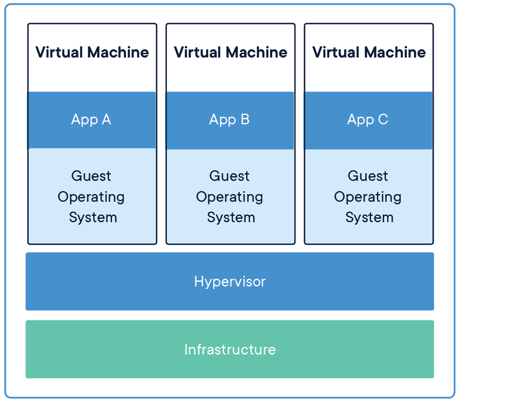

# Virtual Machines

For this course, I will provide some on setting up a Linux virtual machine. My default environment is on linux, and it can benefit you to learn a new skill as well as synchronize on what I think is the easiest platform to create software on.

## Resources for Help

* [A 15 Minute Briefing for Getting Setup and Navigating Linux in Virtual Box](https://www.youtube.com/watch?v=ln0bxbDkzPY&list=PLvv0ScY6vfd8YRjgGvXKJRAMZQAxNypcH&index=2)
	* Quick 15 minute introduction to getting setup a Virtual machine and using the terminal in Linux

## Introduction

Supporting Mac, Windows, and Linux development is an interesting engineering challenge. One way to work around supporting all platforms is to use a virtual machine.

### Virtual Machines

A [virtual machine](https://en.wikipedia.org/wiki/Virtual_machine) (VM) is a tool that allows you to emulate an operating system from within your current operating system. For example, if you have a Windows machine you can run a complete Linux operating system. The entire operating system will aappear like it is in a separate application in its own window, but in reality, the virtual machine is emulating an entire operating system.

Want to learn more about what you're doing? Check it out here! [A 15 Minute Briefing for Getting Setup and Navigating Linux in Virtual Box](https://www.youtube.com/watch?v=ln0bxbDkzPY&list=PLvv0ScY6vfd8YRjgGvXKJRAMZQAxNypcH&index=2)

## The Setup

For this course, I recommend using a linux machine if you are having any difficulty with your Windows or Mac environment.

### Download

Pick one of the operating systems that I have provided below. 

Both of these are relatively large files that hold an entire operating system. These files are .ova files (Open Virtualization Appliances) which are basically an collection of files (i.e. archive, or a fancy way of saying a '.zip' file). So essentially an entire operating system in a single file, and a virtual machine (i.e. virtual box, VMWare, QEMU, etc.) understands how to load this file that you are going to download.

1. The download of the Ubuntu 20 virtual machine is here (9 GB Download + 10-20ish GB of space once installed): 
	- https://storage.cloud.google.com/elevated-nuance-167519.appspot.com/Ubuntu20-ShahCourse.ova
2. A second option is an ~10 GB lighter weight version of a VM called Xubuntu. 
	- This is a linux environment as well *that should* work, although the space on the VM is fairly limited.
	- Consider using this option if you have very limited space on your hard drive.
 	- https://storage.googleapis.com/elevated-nuance-167519.appspot.com/xubuntu21-ShahCourse.ova

### Setting up Virtual Box

Listed below are some Virtual Machines (The actual application that can import the .ova file that I have posted above).

1. For Windows and Mac (Pre M1) users
	- I recommend Virtual Box--  https://www.virtualbox.org/
		- (Navigate to Downloads)
			- Choose Windows hosts for windows users
			- Choose OS X hosts for Mac users
	- Once you have virtual box installed, you should be able to launch the application and find the .ova file, or otherwise just click on the .ova file to launch to virtual machine.
2. For Windows and Mac (Pre M1) users who cannot get Virtual Box to work.
	- In the instance that virtual box does not work, you can try another tool by VMWare Workstation which should also work.
		- A direct link below should work for Northeastern folks, but otherwise you can try googling "Northeastern Khoury VMWare" if it does not
		- https://e5.onthehub.com/WebStore/ProductsByMajorVersionList.aspx?cmi_mnuMain_child_child=f1562751-3e57-eb11-8133-000d3af41938&cmi_mnuMain_child=aafc5891-884f-e511-940f-b8ca3a5db7a1&ws=b3c1a62b-c840-de11-b696-0030485a8df0&vsro=8
		- More information can be found here: [import Virtual Box appliances](https://kb.vmware.com/s/article/2053864)
3. For Mac and M1 Users who definitely want something that works but is **not free**
	- Parallels also officially supports M1--though it is not free to my knowledge.
	- Student edition (discounted) https://www.parallels.com/landingpage/pd/education/
4. For Mac and Mac M1 Users who want something that is **free but may be slow**
	- First try:
		- For Mac Users, who have a really new Mac (from 2020 with the M1 processor), you may need to use a different virtual machine.
		- (Try the following lnk below) 
		- https://eshop.macsales.com/blog/72081-utm-virtual-machine-on-m1-mac/
	- Second try QEMU (another emulator) **Note** in QEMU if you run into trouble press (ctrl+alt+g) to get the mouse back.
		- Visit https://www.qemu.org/download/#macos
		- ([Install brew here](https://brew.sh/) if you do not have it)
		- Run: `brew install qemu` `
			- This will install QEMU
			- Then we need to convert the .ova file to a format QEMU understands (I had trouble getting the .ova to run without [these directions](https://kevrocks67.github.io/blog/running-vmware-images-in-qemu.html))
			- `tar -xvf Ubuntu20-ShahCourse.ova` Extract the contents
			- `qemu-img convert -O qcow2 Ubuntu20-ShahCourse-disk001.vmdk Ubuntu20-ShahCourse.qcow2` Convert to a proper file
			- `qemu-system-x86_64 -accel tcg -usb -m 4096 -drive file="/Users/mike/Downloads/Ubuntu20-ShahCourse.qcow2"` Finally run the emulator
				- Note, if this runs slow, try increasing memory from 4096 to something higher.
				- Note, if this runs slow, try replacing `-accel tcg` with `-accel hvf` to use hardware acceleration.
				- **NOTE** Without hardware acceleration, it is likely that the VM will run very slow--feel free to open up a piazza discussion regarding this.

## After Starting the Virtual Machine (i.e. after the Download of Virtual Box and the .ova file for Ubuntu)

Once you have imported successfully the .ova file and the operating system has been loaded, you can login.

* username: user
* password: user

## Basic Linux Commands

If it is your first time navigating Linux, here are some other handy commands or things for you to know.

1. There is a 'notes.txt' file on the desktop with some general notes about the course.
2. Finding and navigating a terminal is the easiest way to use Linux--but it does take some practice.
	- Open a terminal (ctrl+alt+t)
		- Type: pwd 
			- This tells you the current directory you are in
		- Type: ls
			- This lists the files and folders where you currently are
		- Type: cd dir
			- This 'changes your directory' to a folder called 'dir' if it exists from your current location (pwd)
		- If you want an IDE, I have installed 'codeblocks' 
			- You can either locate it on the left-hand side bar, or otherwise type 'codeblocks' in a terminal to launch it. This may be a more comfortable tool to work in if you are use to using IDEs

# Random Notes

- Occassionally I have seen folks copy files between Windows and Linux and little ^M's will show up at the end of the line. Be careful if you see these and they cause syntax errors. 
	- These line endings may be operating system or editor specific. Often text editors can remove these automatically for you.
- You may otherwise choose to use a Mac and using the terminal or XCode, or on windows using either mysy2 or the [Windows Linux Subsystem](https://docs.microsoft.com/en-us/windows/wsl/install-win10) (which is a wonderful tool). 
	- But with all those options in mind, the terminal in the linux environment will be the preferred work method.
	- I am providing the class with a virtual machine that should suffice for all of our basic programming needs.

